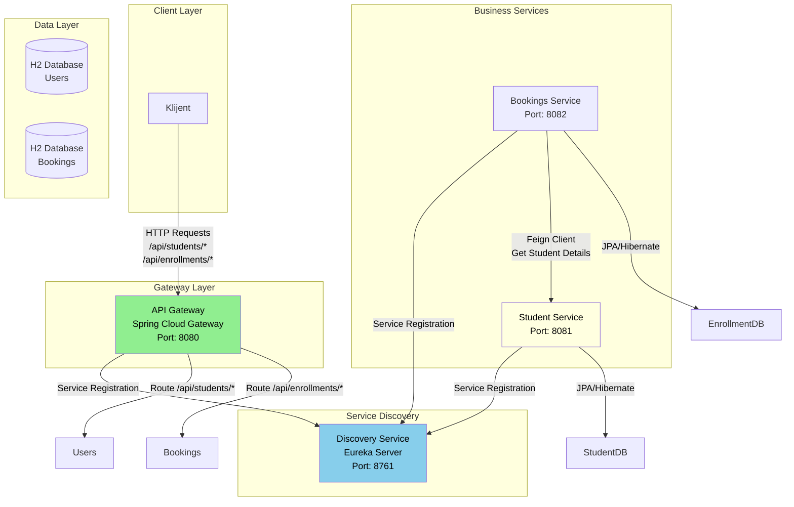

# Mikroserivsna arhitektura - Studentski Upis (Student enrollment)

## Opis projekta
Ovaj projekat predstavlja mikroservisni sistem za urpavljanje studentima i njihovim upisom koristeći Spring Boot i Spring Cloud tehnologije.

## Arhitektura sistema
Sistem je podeljen na četiri glavna modula:

| Modul | Port | Port | Opis |
|-------|------|------|------|
| **discovery-service** | 8761 | /eureka/* | Eureka server – registracija i monitoring servisa |
| **api-gateway** | 8080 | /api/students/* <br> /api/enrollments/* | Centralna tačka ulaza – rutiranje zahteva ka servisima, API-key autentifikacija |
| **student-service** | 8081 | /api/students/* | CRUD nad `Student`, validacija pomoću Hibernate Validatora |
| **orders-service** | 8082 | /api/enrollments/* | CRUD nad `Enrollment` + Feign poziv ka `student-service` + Resilience4j fallback + RabbitMQ događaji |

---
### 🎨 Dijagram Komponenti


## Tehnologije

- **Java 17**
- **Java SDK (JDK): 21** ms-21
- **Spring Boot 3.4.10**
- **Spring Cloud 2024.0.0**
- **Spring Cloud Gateway** - API Gateway
- **Netflix Eureka** - Service Discovery
- **Spring Data JPA** - Persistence layer
- **H2 Database** - In-memory baza podataka
- **Lombok** - Code generation
- **ModelMapper** - Object mapping
- **Resilience4j** - Circuit Breaker i Retry patterns
- **OpenFeign** - HTTP client za komunikaciju između servisa
- **Maven** - Dependency management

## Pokretanje 
### Redosled pokretanja
**Servisi MORAJU biti pokrenuti u sledećem redosledu:**<br>
1️⃣ **Discovery-Service** <br>
2️⃣ **API-Gateway**<br>
3️⃣ **Student-Service**  <br>
4️⃣ **Enrollment-Service**<br>

### Eureka Dashboard
- **URL:** http://localhost:8761
- **Funkcija:** Pregled svih registrovanih servisa

### H2 Database Console
- **Student Service:** http://localhost:8081/h2-console
  - JDBC URL: `jdbc:h2:mem:studentdb`
  - Username: `sa`
  - Password: (prazno)
- **Enrollment Service:** http://localhost:8082/h2-console
  - JDBC URL: `jdbc:h2:mem:enrollmentdb`
  - Username: `sa`
  - Password: (prazno)

## API Endpoints

### Kroz API Gateway (http://localhost:8080)

#### Student Service
- `GET /api/students` - Dobijanje svih studenata
- `GET /api/students/{id}` - Dobijanje studenata po ID
- `POST /api/students` - Kreiranje novog studenata
- `PUT /api/students/{id}` - Ažuriranje studenata
- `DELETE /api/students/{id}` - Brisanje studenata

#### Bookings Service
- `GET /api/enrollments` - Dobijanje svih studentskih upisa
- `GET /api/enrollments/{id}` - Dobijanje studentskog upisa po ID
- `POST /api/enrollments` - Kreiranje novog studentskog upisa
- `PUT /api/enrollments/{id}` - Ažuriranje studentskog upisa
- `DELETE /api/enrollments/{id}` - Brisanje studentskog upisa
- `GET /api/enrollments/{id}/details` - Dobijanje studentskih upisa sa informacijama o korisnicima

## Struktura Podataka

### Student
```json
{
  "firstName": "Nikola",
  "lastName": "Živadinović",
  "indexNumber": "55-2022",
  "email": "nikola.zivadinovic2406@gmail.com",
  "phone": "0621234567"
}
```

### Booking Entity
```json
{
  "studentID": 1,
  "programName": "Informatika: Softversko inžinjerstvo",
  "semester": "7",
  "status": "Upisan",
  "createdAt": "5.11.2025"
}
```
## Konfiguracija

### API Gateway
- **API ključ:** `NikolaZivadinovic552022` (definisan u application.yaml)
- **Rutiranje:** Automatsko rutiranje na osnovu URL putanje

### Circuit Breaker (Enrollment Service)
- **Sliding window size:** 5 poziva
- **Failure rate threshold:** 50%
- **Wait duration:** 5 sekundi
- **Retry attempts:** 3 puta sa 2 sekunde pauze

## Kratka dokumentacija

### Obavezne funkcionalnosti
- ✔ Dva mikroservisa (`student-service`, `enrollment-service`)  
- ✔ Eureka server i Gateway  
- ✔ Feign komunikacija  
- ✔ Validacija i korektni HTTP statusi  
- ✔ Circuit Breaker + Retry  
- ✔ Agregacioni endpoint (`/enrollments/{id}/details`)  
- ✔ 2–3 test klase  

### Bonus funkcionalnosti
- 🟢 **RabbitMQ** događaji (“EnrollmentCreated”)  
- 🟢 **API-key** autentifikacija na Gateway-u 

## Autor
**Ime i prezime:** Nikola Živadinović
**Predmet:** Programiranje distribuiranih sistema  
**Godina:** 2025 